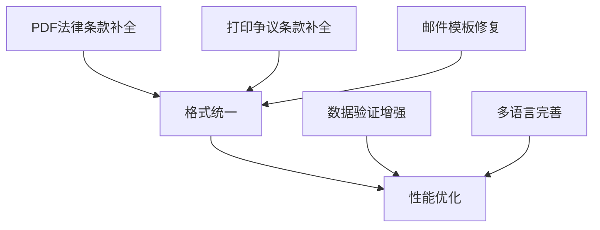

# 完美法国发票输出方式子任务开发计划

## 项目概述
基于当前发票预览模板，确保PDF、打印和邮件三种输出方式都能完整输出法国发票的所有必需数据，符合法国税法要求。

## 当前实现状态分析

### 1. 发票预览 (InvoicePreview.jsx) ✅ 完整
- **公司信息**: 完整包含SIREN、SIRET、VAT号、法律形式、注册资本、RCS号、NAF代码
- **客户信息**: 支持公司/个人、账单地址、交付地址
- **发票详情**: 发票号、日期、到期日、服务日期
- **项目明细**: 完整的商品/服务列表
- **税务信息**: TVA豁免、自清算、标准税率处理
- **付款信息**: 银行信息、付款条款、法律条款
- **法律条款**: 保留所有权、争议解决、TVA信息

### 2. PDF生成 (pdfServicePDFKit.js) ⚠️ 部分缺失
**已实现**:
- 基本公司和客户信息
- 发票详情和项目明细
- TVA豁免和自清算条款
- 基本法律信息

**缺失或不完整**:
- 法国公司完整法律信息显示不规范
- 交付地址处理不完整
- 付款条款和银行信息格式需优化
- 法律条款（保留所有权、争议解决）缺失

### 3. 打印预览 (PrintPreview.jsx) ⚠️ 部分缺失
**已实现**:
- 基本发票结构
- 公司和客户信息
- 项目明细和总计

**缺失或不完整**:
- 法国特定法律信息显示不完整
- TVA豁免和自清算条款可能缺失
- 付款信息和银行详情不完整
- 法律条款缺失

### 4. 邮件发送 (emailService.js) ⚠️ 部分缺失
**已实现**:
- 基本发票数据处理
- PDF附件生成
- 模板适配器支持

**缺失或不完整**:
- 邮件模板可能不包含完整的法国发票信息
- TVA处理逻辑需要验证
- 法国特定字段的邮件显示

## 数据完整性对比

### 发票预览 vs 其他输出方式

| 数据项 | 预览 | PDF | 打印 | 邮件 | 优先级 |
|--------|------|-----|------|------|--------|
| 公司SIREN | ✅ | ✅ | ✅ | ⚠️ | 高 |
| 公司SIRET | ✅ | ✅ | ✅ | ⚠️ | 高 |
| 公司VAT号 | ✅ | ✅ | ✅ | ⚠️ | 高 |
| 法律形式 | ✅ | ⚠️ | ❌ | ❌ | 高 |
| 注册资本 | ✅ | ⚠️ | ❌ | ❌ | 高 |
| RCS号码 | ✅ | ⚠️ | ✅ | ❌ | 高 |
| NAF代码 | ✅ | ⚠️ | ✅ | ❌ | 高 |
| 交付地址 | ✅ | ⚠️ | ❌ | ❌ | 中 |
| TVA豁免条款 | ✅ | ✅ | ✅ | ⚠️ | 高 |
| 自清算条款 | ✅ | ✅ | ✅ | ⚠️ | 高 |
| 银行信息 | ✅ | ✅ | ✅ | ⚠️ | 高 |
| 付款条款 | ✅ | ✅ | ✅ | ⚠️ | 高 |
| 保留所有权条款 | ✅ | ❌ | ✅ | ❌ | 高 |
| 争议解决条款 | ✅ | ❌ | ❌ | ❌ | 高 |
| 延迟付款罚金 | ✅ | ✅ | ✅ | ⚠️ | 高 |

### 详细缺失数据分析

#### PDF生成 (pdfServicePDFKit.js)
**缺失的关键法律条款**:
- ❌ 保留所有权条款 (Clause de réserve de propriété)
- ❌ 争议解决条款 (Règlement des différends)

**不完整的公司信息**:
- ⚠️ 法律形式显示格式需要规范化
- ⚠️ 注册资本格式需要优化
- ⚠️ RCS和NAF信息显示不规范

#### 打印预览 (PrintPreview.jsx)
**已完整实现** ✅:
- 所有法国公司法律信息 (SIREN, SIRET, VAT, RCS, NAF)
- TVA豁免和自清算条款
- 银行信息和付款条款
- 保留所有权条款
- 延迟付款罚金条款

**缺失项**:
- ❌ 争议解决条款 (需要添加)
- ❌ 交付地址处理逻辑不完整

#### 邮件服务 (emailService.js)
**需要验证的项目**:
- ⚠️ 所有法国特定字段的邮件模板支持
- ❌ 法律条款的邮件格式
- ❌ 完整的公司法律信息显示

## 开发任务清单 (按优先级和依赖关系排序)

### 🔥 第一优先级: 法律合规性修复 (紧急 - 1-2天)

#### 1. PDF生成法律条款补全 
**文件**: `backend/src/services/pdfServicePDFKit.js`
**依赖**: 无
**工作量**: 4-6小时
- [ ] 添加保留所有权条款 (Clause de réserve de propriété)
- [ ] 添加争议解决条款 (Règlement des différends)  
- [ ] 优化法国公司法律信息显示格式
- [ ] 规范化RCS和NAF信息显示

#### 2. 打印预览争议解决条款补全
**文件**: `frontend/src/components/PrintPreview.jsx`
**依赖**: 无
**工作量**: 1-2小时
- [ ] 添加争议解决条款显示
- [ ] 完善交付地址处理逻辑

#### 3. 邮件模板法国信息验证
**文件**: `backend/src/services/emailService.js`
**依赖**: 无  
**工作量**: 2-3小时
- [ ] 验证邮件模板包含所有法国特定字段
- [ ] 添加法律条款的邮件格式支持
- [ ] 确保公司法律信息完整显示

### ⚡ 第二优先级: 数据一致性优化 (重要 - 1天)

#### 4. 三种输出方式格式统一
**文件**: 多个文件
**依赖**: 完成第一优先级任务
**工作量**: 3-4小时
- [ ] 统一PDF、打印、邮件的布局格式
- [ ] 确保法律条款显示的一致性
- [ ] 优化法国发票的视觉呈现

#### 5. 数据验证和错误处理增强
**文件**: 相关验证文件
**依赖**: 无
**工作量**: 2-3小时
- [ ] 添加法国发票数据完整性验证
- [ ] 改进缺失数据的友好提示
- [ ] 完善生成失败的回退机制

### 📊 第三优先级: 用户体验优化 (一般 - 0.5-1天)

#### 6. 性能优化
**文件**: 相关服务文件
**依赖**: 完成前两个优先级
**工作量**: 2-3小时
- [ ] PDF生成性能优化 (缓存、异步处理)
- [ ] 打印预览渲染优化

#### 7. 多语言支持完善
**文件**: 法语标签文件
**依赖**: 无
**工作量**: 1-2小时
- [ ] 完善法语标签的准确翻译
- [ ] 确保法律条款的标准法语表述

## 具体实施计划

### Day 1: PDF生成修复 (最高优先级)
**上午 (4小时)**:
1. 分析当前PDF生成中缺失的法律条款
2. 实现保留所有权条款添加
3. 实现争议解决条款添加

**下午 (4小时)**:
4. 优化法国公司法律信息显示格式
5. 规范化RCS和NAF信息显示
6. 测试PDF生成的完整性

### Day 2: 打印和邮件修复
**上午 (3小时)**:
1. 打印预览争议解决条款补全
2. 完善交付地址处理逻辑
3. 测试打印预览功能

**下午 (4小时)**:
4. 邮件模板法国信息验证和修复
5. 添加法律条款的邮件格式支持
6. 全面测试三种输出方式的一致性

### Day 3: 优化和完善
**上午 (3小时)**:
1. 统一三种输出方式的格式
2. 数据验证和错误处理增强

**下午 (2小时)**:
3. 性能优化
4. 多语言支持完善
5. 最终测试和文档更新

## 关键依赖关系

## 测试验证计划

### 功能测试检查清单
- [ ] 创建包含所有法国字段的测试发票
- [ ] 验证PDF输出包含所有法律条款
- [ ] 验证打印预览与发票预览一致
- [ ] 验证邮件包含完整的法国发票信息
- [ ] 测试TVA豁免模式的所有输出
- [ ] 测试自清算模式的所有输出

### 合规性验证
- [ ] 检查所有必需的法国税法信息
- [ ] 验证法律条款的准确性和完整性
- [ ] 确认SIREN/SIRET/VAT等信息格式正确

### 一致性测试
- [ ] 对比三种输出方式的数据完整性
- [ ] 检查格式和布局的统一性
- [ ] 验证法语标签的准确性

## 技术实现细节

### 需要修改的文件

1. **backend/src/services/pdfServicePDFKit.js**
   - 添加完整的法国公司法律信息显示
   - 添加保留所有权和争议解决条款
   - 优化交付地址处理逻辑

2. **frontend/src/components/PrintPreview.jsx**
   - 验证并补充所有法国发票必需信息
   - 添加缺失的法律条款显示
   - 确保与InvoicePreview.jsx的一致性

3. **backend/src/services/emailService.js**
   - 验证邮件模板的数据完整性
   - 确保法国特定字段的正确处理

4. **相关的法语标签文件**
   - 添加缺失的法语标签
   - 确保法律条款的准确翻译

### 测试计划

1. **功能测试**
   - 创建包含所有法国特定字段的测试发票
   - 验证PDF、打印、邮件三种输出的数据完整性
   - 测试TVA豁免和自清算模式

2. **合规性测试**
   - 验证生成的发票符合法国税法要求
   - 检查所有必需的法律信息是否完整

3. **一致性测试**
   - 对比三种输出方式的数据一致性
   - 确保格式和内容的统一性

## 预期成果

完成后，系统将能够：
1. 生成完全符合法国税法要求的发票PDF
2. 提供与预览完全一致的打印输出
3. 发送包含完整法国发票信息的邮件
4. 确保三种输出方式的数据完整性和一致性

## 风险评估

- **高风险**: 法律合规性问题可能导致税务风险
- **中风险**: 数据不一致可能影响用户信任
- **低风险**: 性能问题可能影响用户体验

## 时间估算

- **阶段1 (紧急)**: 2-3个工作日
- **阶段2 (重要)**: 1-2个工作日  
- **阶段3 (一般)**: 1个工作日

**总计**: 4-6个工作日

---

*文档创建时间: 2024年12月*
*最后更新: 2024年12月*